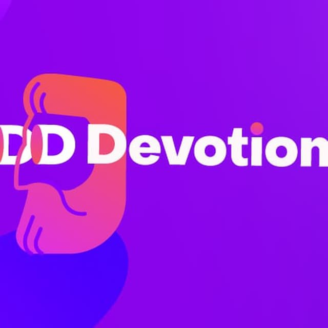

DDDevotion
==========

Репозиторий с учебным проектом на Symfony: Domain Driven Design & Clean Architecture

**ВАЖНО!**
 - это учебный проект и он не годится для продакшена "как есть".
 - в коде сделано много допущений для упрощения понимания 
 
Основная задача проекта - показать возможные вариантов ведения разработки с использованием DDD-подхода.

Митапы
------

 - Ветка **Meetup_23_12_2020**: От теории к коду - рассматриваем реализцию проекта с применением DDD-подхода и чистой архитектуры
 - Ветка **Meetup_19_08_2021**: DDDocs - подход к сбору документации, используя тактические DDD-паттерны и особенности архитектуры
